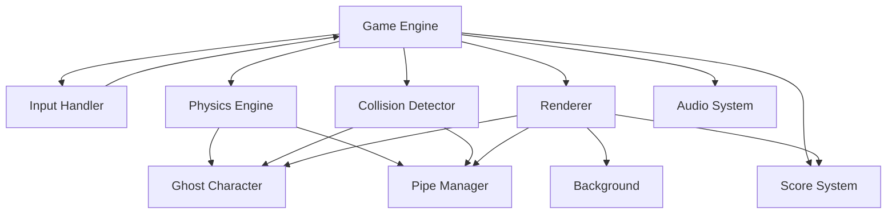

# Design Document: Flappy Kiro

## Overview

Flappy Kiro is a browser-based endless scroller game implemented using HTML5 Canvas and vanilla JavaScript. The architecture follows a game loop pattern with clear separation between game state management, rendering, physics simulation, and input handling.

The game consists of a ghost character that the player controls by pressing the spacebar to apply upward velocity. The ghost continuously falls due to gravity and must navigate through gaps in scrolling pipe obstacles. The game tracks score based on successfully passed pipes and ends when the ghost collides with pipes or screen boundaries.

Key technical decisions:
- **HTML5 Canvas**: Provides hardware-accelerated 2D rendering suitable for retro-style pixel graphics
- **requestAnimationFrame**: Ensures smooth 60 FPS gameplay synchronized with browser refresh rate
- **Vanilla JavaScript**: No framework dependencies for minimal load time and maximum compatibility
- **Sprite-based rendering**: Ghost character uses a loaded image asset while pipes use procedural drawing

## Architecture

The system follows a modular architecture with these core subsystems:



### Game Loop Architecture

The game loop follows the standard pattern:
1. **Input Processing**: Capture spacebar events and update input state
2. **Update**: Apply physics, move obstacles, check collisions, update score
3. **Render**: Clear canvas and redraw all game elements
4. **Schedule**: Use requestAnimationFrame for next iteration

### State Management

The game maintains a single state object containing:
- Game status (waiting, playing, game_over)
- Ghost position, velocity, and rotation
- Array of active pipe obstacles
- Current score and high score
- Frame counter for timing pipe generation

## Components and Interfaces

### Game Engine

The central controller that orchestrates all subsystems.

```javascript
class GameEngine {
  constructor(canvasId)
  init()
  startGameLoop()
  update(deltaTime)
  render()
  reset()
  pause()
  resume()
}
```

**Responsibilities**:
- Initialize canvas and load assets
- Manage game state transitions
- Coordinate update and render cycles
- Handle browser visibility changes for pause/resume

### Ghost Character

Represents the player-controlled sprite with physics properties.

```javascript
class Ghost {
  constructor(x, y)
  update(deltaTime)
  jump()
  render(ctx)
  getBounds()
}
```

**Properties**:
- Position: `{x, y}`
- Velocity: `{vx, vy}`
- Rotation: `angle` (calculated from velocity)
- Dimensions: `{width: 40, height: 40}`
- Sprite: loaded Image object

**Physics Constants**:
- Gravity: 0.5 pixels/frame²
- Jump velocity: -6 pixels/frame
- Max velocity: ±10 pixels/frame

### Pipe Manager

Manages the lifecycle of pipe obstacles.

```javascript
class PipeManager {
  constructor()
  update(deltaTime)
  generatePipe()
  removePipe(pipe)
  getPipes()
  reset()
}
```

**Pipe Generation**:
- Frequency: Every 150 frames
- Initial position: x = 400
- Gap size: 150 pixels
- Gap position: Random between y = 100 and y = 400
- Scroll speed: 3 pixels/frame leftward

**Pipe Structure**:
```javascript
{
  x: number,
  topHeight: number,
  bottomY: number,
  width: 60,
  passed: boolean
}
```

### Collision Detector

Implements rectangular bounding box collision detection.

```javascript
class CollisionDetector {
  static checkCollision(ghost, pipes)
  static checkBoundary(ghost, canvasHeight)
  static boxIntersect(box1, box2)
}
```

**Algorithm**:
- Use 80% of sprite dimensions for hitbox (allows slight overlap for forgiving gameplay)
- Check ghost against each pipe's top and bottom rectangles
- Check ghost against canvas top (y < 0) and bottom (y > 600)

### Score System

Tracks and displays player score.

```javascript
class ScoreSystem {
  constructor()
  increment()
  reset()
  getScore()
  render(ctx, x, y)
}
```

**Scoring Logic**:
- Increment when ghost's x-position exceeds pipe's center x-position
- Mark pipe as "passed" to prevent double-counting
- Display at bottom center with 48px white text with black outline

### Audio System

Manages sound effect playback.

```javascript
class AudioSystem {
  constructor()
  preload(soundMap)
  play(soundName)
  setVolume(volume)
}
```

**Sound Effects**:
- `jump.wav`: Played on spacebar press
- `game_over.wav`: Played when collision detected

**Implementation**:
- Use HTML5 Audio API
- Preload all sounds during initialization
- Handle audio context restrictions (user interaction required)

### Renderer

Handles all canvas drawing operations.

```javascript
class Renderer {
  constructor(canvas)
  clear()
  drawBackground()
  drawClouds()
  drawGhost(ghost)
  drawPipes(pipes)
  drawScore(score)
  drawMessage(text, y)
}
```

**Rendering Order**:
1. Background (light blue #87CEEB)
2. Clouds (white rounded rectangles)
3. Pipes (green #4CAF50 with dark borders #2E7D32)
4. Ghost (sprite with rotation)
5. Score (bottom center)
6. Messages (center for game states)

**Visual Style**:
- Disable image smoothing for pixel-perfect retro look
- Use solid colors for geometric shapes
- Apply rotation transform for ghost tilt effect

### Input Handler

Captures and processes keyboard input.

```javascript
class InputHandler {
  constructor(gameEngine)
  init()
  handleKeyDown(event)
  handleKeyUp(event)
}
```

**Key Bindings**:
- SPACE: Jump (during play) or Start/Restart (during waiting/game_over)

**State-dependent behavior**:
- Waiting state: SPACE starts game
- Playing state: SPACE triggers jump
- Game over state: SPACE resets and starts new game

## Data Models

### Game State

```javascript
{
  status: 'waiting' | 'playing' | 'game_over',
  frameCount: number,
  isPaused: boolean
}
```

### Ghost State

```javascript
{
  x: number,
  y: number,
  vx: number,
  vy: number,
  angle: number,
  width: 40,
  height: 40,
  sprite: Image
}
```

### Pipe State

```javascript
{
  x: number,
  topHeight: number,
  bottomY: number,
  width: 60,
  gapSize: 150,
  passed: boolean
}
```

### Score State

```javascript
{
  current: number,
  high: number
}
```

### Asset Manifest

```javascript
{
  images: {
    ghost: 'assets/ghosty.png'
  },
  sounds: {
    jump: 'assets/jump.wav',
    gameOver: 'assets/game_over.wav'
  }
}
```

