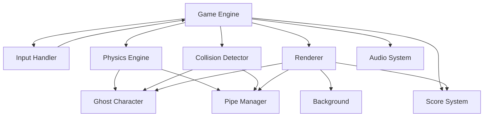

# Design Document: Flappy Kiro

## Overview

Flappy Kiro is a browser-based endless scroller game implemented using HTML5 Canvas and vanilla JavaScript. The architecture follows a game loop pattern with clear separation between game state management, rendering, physics simulation, and input handling.

The game consists of a ghost character that the player controls by pressing the spacebar to apply upward velocity. The ghost continuously falls due to gravity and must navigate through gaps in scrolling pipe obstacles. The game tracks score based on successfully passed pipes and ends when the ghost collides with pipes or screen boundaries.

Key technical decisions:
- **HTML5 Canvas**: Provides hardware-accelerated 2D rendering suitable for retro-style pixel graphics
- **requestAnimationFrame**: Ensures smooth 60 FPS gameplay synchronized with browser refresh rate
- **Vanilla JavaScript**: No framework dependencies for minimal load time and maximum compatibility
- **Sprite-based rendering**: Ghost character uses a loaded image asset while pipes use procedural drawing

## Architecture

The system follows a modular architecture with these core subsystems:



### Game Loop Architecture

The game loop follows the standard pattern:
1. **Input Processing**: Capture spacebar events and update input state
2. **Update**: Apply physics, move obstacles, check collisions, update score
3. **Render**: Clear canvas and redraw all game elements
4. **Schedule**: Use requestAnimationFrame for next iteration

### State Management

The game maintains a single state object containing:
- Game status (waiting, playing, game_over)
- Ghost position, velocity, and rotation
- Array of active pipe obstacles
- Current score and high score
- Frame counter for timing pipe generation

## Configuration

All game parameters are centralized in a single CONFIG object at the top of the main JavaScript file. This approach allows easy tuning of game behavior without searching through code.

### CONFIG Object Structure

```javascript
const CONFIG = {
  // Canvas dimensions
  canvas: {
    width: 400,
    height: 600
  },
  
  // Ghost character settings
  ghost: {
    width: 40,
    height: 40,
    startX: 100,
    startY: 300,
    gravity: 0.5,           // pixels/frame²
    jumpVelocity: -6,       // pixels/frame
    maxVelocity: 10,        // pixels/frame (up or down)
    hitboxScale: 0.8        // 80% of sprite size for forgiving collision
  },
  
  // Pipe obstacle settings
  pipes: {
    width: 60,
    gapSize: 150,
    minGapY: 100,
    maxGapY: 400,
    scrollSpeed: 3,         // pixels/frame
    spawnInterval: 150,     // frames between pipe generation
    spawnX: 400             // initial x position for new pipes
  },
  
  // Visual settings
  visual: {
    backgroundColor: '#87CEEB',
    pipeColor: '#4CAF50',
    pipeBorderColor: '#2E7D32',
    cloudColor: '#FFFFFF',
    scoreColor: '#FFFFFF',
    scoreFontSize: 48,
    messageColor: '#FFFFFF',
    messageFontSize: 36,
    disableImageSmoothing: true  // for pixel-perfect retro look
  },
  
  // Physics and timing
  physics: {
    maxDeltaTime: 100       // cap deltaTime to prevent physics glitches
  },
  
  // Asset paths
  assets: {
    ghostSprite: 'assets/ghosty.png',
    jumpSound: 'assets/jump.wav',
    gameOverSound: 'assets/game_over.wav'
  },
  
  // Testing configuration
  testing: {
    propertyTestIterations: 100  // minimum iterations for property-based tests
  }
};
```

### Configuration Usage

Components reference CONFIG values instead of hardcoded constants:

```javascript
// Example: Ghost initialization
this.x = CONFIG.ghost.startX;
this.y = CONFIG.ghost.startY;
this.width = CONFIG.ghost.width;

// Example: Physics update
this.vy += CONFIG.ghost.gravity;
this.vy = Math.max(-CONFIG.ghost.maxVelocity, 
                   Math.min(CONFIG.ghost.maxVelocity, this.vy));

// Example: Pipe generation
if (frameCount % CONFIG.pipes.spawnInterval === 0) {
  generatePipe();
}
```

### Benefits

- **Easy tuning**: Adjust game difficulty by changing values in one place
- **Maintainability**: Clear documentation of all magic numbers
- **Testing**: Easy to override values for specific test scenarios
- **Experimentation**: Quick iteration on game feel without code diving

## Components and Interfaces

### Game Engine

The central controller that orchestrates all subsystems.

```javascript
class GameEngine {
  constructor(canvasId)
  init()
  startGameLoop()
  update(deltaTime)
  render()
  reset()
  pause()
  resume()
}
```

**Responsibilities**:
- Initialize canvas and load assets
- Manage game state transitions
- Coordinate update and render cycles
- Handle browser visibility changes for pause/resume

### Ghost Character

Represents the player-controlled sprite with physics properties.

```javascript
class Ghost {
  constructor(x, y)
  update(deltaTime)
  jump()
  render(ctx)
  getBounds()
}
```

**Properties**:
- Position: `{x, y}` (initialized from `CONFIG.ghost.startX`, `CONFIG.ghost.startY`)
- Velocity: `{vx, vy}`
- Rotation: `angle` (calculated from velocity)
- Dimensions: `{width, height}` (from `CONFIG.ghost.width`, `CONFIG.ghost.height`)
- Sprite: loaded Image object (from `CONFIG.assets.ghostSprite`)

**Physics Constants** (from CONFIG):
- Gravity: `CONFIG.ghost.gravity` (default: 0.5 pixels/frame²)
- Jump velocity: `CONFIG.ghost.jumpVelocity` (default: -6 pixels/frame)
- Max velocity: `CONFIG.ghost.maxVelocity` (default: ±10 pixels/frame)

### Pipe Manager

Manages the lifecycle of pipe obstacles.

```javascript
class PipeManager {
  constructor()
  update(deltaTime)
  generatePipe()
  removePipe(pipe)
  getPipes()
  reset()
}
```

**Pipe Generation** (from CONFIG):
- Frequency: Every `CONFIG.pipes.spawnInterval` frames (default: 150)
- Initial position: x = `CONFIG.pipes.spawnX` (default: 400)
- Gap size: `CONFIG.pipes.gapSize` pixels (default: 150)
- Gap position: Random between y = `CONFIG.pipes.minGapY` and y = `CONFIG.pipes.maxGapY` (default: 100-400)
- Scroll speed: `CONFIG.pipes.scrollSpeed` pixels/frame leftward (default: 3)

**Pipe Structure**:
```javascript
{
  x: number,
  topHeight: number,
  bottomY: number,
  width: CONFIG.pipes.width,  // default: 60
  passed: boolean
}
```

### Collision Detector

Implements rectangular bounding box collision detection.

```javascript
class CollisionDetector {
  static checkCollision(ghost, pipes)
  static checkBoundary(ghost, canvasHeight)
  static boxIntersect(box1, box2)
}
```

**Algorithm**:
- Use `CONFIG.ghost.hitboxScale` of sprite dimensions for hitbox (default: 80%, allows slight overlap for forgiving gameplay)
- Check ghost against each pipe's top and bottom rectangles
- Check ghost against canvas top (y < 0) and bottom (y > `CONFIG.canvas.height`)

### Score System

Tracks and displays player score.

```javascript
class ScoreSystem {
  constructor()
  increment()
  reset()
  getScore()
  render(ctx, x, y)
}
```

**Scoring Logic**:
- Increment when ghost's x-position exceeds pipe's center x-position
- Mark pipe as "passed" to prevent double-counting
- Display at bottom center with `CONFIG.visual.scoreFontSize` (default: 48px) text in `CONFIG.visual.scoreColor` (default: white) with black outline

### Audio System

Manages sound effect playback.

```javascript
class AudioSystem {
  constructor()
  preload(soundMap)
  play(soundName)
  setVolume(volume)
}
```

**Sound Effects** (from CONFIG.assets):
- `CONFIG.assets.jumpSound` (default: 'assets/jump.wav'): Played on spacebar press
- `CONFIG.assets.gameOverSound` (default: 'assets/game_over.wav'): Played when collision detected

**Implementation**:
- Use HTML5 Audio API
- Preload all sounds during initialization
- Handle audio context restrictions (user interaction required)

### Renderer

Handles all canvas drawing operations.

```javascript
class Renderer {
  constructor(canvas)
  clear()
  drawBackground()
  drawClouds()
  drawGhost(ghost)
  drawPipes(pipes)
  drawScore(score)
  drawMessage(text, y)
}
```

**Rendering Order**:
1. Background (`CONFIG.visual.backgroundColor`, default: #87CEEB)
2. Clouds (`CONFIG.visual.cloudColor`, default: white rounded rectangles)
3. Pipes (`CONFIG.visual.pipeColor` with `CONFIG.visual.pipeBorderColor`, defaults: #4CAF50 with #2E7D32)
4. Ghost (sprite with rotation)
5. Score (bottom center)
6. Messages (center for game states)

**Visual Style** (from CONFIG.visual):
- Disable image smoothing (`CONFIG.visual.disableImageSmoothing`) for pixel-perfect retro look
- Use solid colors for geometric shapes
- Apply rotation transform for ghost tilt effect

### Input Handler

Captures and processes keyboard input.

```javascript
class InputHandler {
  constructor(gameEngine)
  init()
  handleKeyDown(event)
  handleKeyUp(event)
}
```

**Key Bindings**:
- SPACE: Jump (during play) or Start/Restart (during waiting/game_over)

**State-dependent behavior**:
- Waiting state: SPACE starts game
- Playing state: SPACE triggers jump
- Game over state: SPACE resets and starts new game

## Data Models

### Game State

```javascript
{
  status: 'waiting' | 'playing' | 'game_over',
  frameCount: number,
  isPaused: boolean
}
```

### Ghost State

```javascript
{
  x: number,                    // initialized from CONFIG.ghost.startX
  y: number,                    // initialized from CONFIG.ghost.startY
  vx: number,
  vy: number,
  angle: number,
  width: CONFIG.ghost.width,    // default: 40
  height: CONFIG.ghost.height,  // default: 40
  sprite: Image                 // loaded from CONFIG.assets.ghostSprite
}
```

### Pipe State

```javascript
{
  x: number,
  topHeight: number,
  bottomY: number,
  width: CONFIG.pipes.width,    // default: 60
  gapSize: CONFIG.pipes.gapSize, // default: 150
  passed: boolean
}
```

### Score State

```javascript
{
  current: number,
  high: number
}
```

### Asset Manifest

Asset paths are defined in CONFIG.assets:

```javascript
{
  images: {
    ghost: CONFIG.assets.ghostSprite  // default: 'assets/ghosty.png'
  },
  sounds: {
    jump: CONFIG.assets.jumpSound,      // default: 'assets/jump.wav'
    gameOver: CONFIG.assets.gameOverSound  // default: 'assets/game_over.wav'
  }
}
```


## Correctness Properties

*A property is a characteristic or behavior that should hold true across all valid executions of a system—essentially, a formal statement about what the system should do. Properties serve as the bridge between human-readable specifications and machine-verifiable correctness guarantees.*

### Property 1: Jump applies correct upward velocity

*For any* ghost character state during active gameplay, when the jump action is triggered, the ghost's vertical velocity should be set to `CONFIG.ghost.jumpVelocity` (default: -6 pixels per frame).

**Validates: Requirements 2.1**

### Property 2: Jump triggers audio feedback

*For any* active game session, when the jump action is triggered, the jump sound effect should be played.

**Validates: Requirements 2.2**

### Property 3: Gravity consistently applied

*For any* ghost character state during active gameplay, after each physics update, the vertical velocity should increase by `CONFIG.ghost.gravity` (default: 0.5 pixels per frame) for downward acceleration.

**Validates: Requirements 3.1**

### Property 4: Velocity clamping

*For any* ghost character state and any sequence of physics updates, the vertical velocity should never exceed `CONFIG.ghost.maxVelocity` (default: 10 pixels per frame) in either direction (upward or downward).

**Validates: Requirements 3.3, 3.4**

### Property 5: Rotation reflects velocity

*For any* ghost character with a given vertical velocity, the rotation angle should be proportional to that velocity, providing visual feedback of movement direction.

**Validates: Requirements 3.5**

### Property 6: Pipe generation timing

*For any* active game session, a new pipe obstacle should be generated every `CONFIG.pipes.spawnInterval` frames (default: 150).

**Validates: Requirements 4.2**

### Property 7: Pipe generation constraints

*For any* generated pipe obstacle, it should have a width of `CONFIG.pipes.width` (default: 60 pixels), a gap of `CONFIG.pipes.gapSize` (default: 150 pixels) between top and bottom sections, and the gap's vertical position should be between `CONFIG.pipes.minGapY` and `CONFIG.pipes.maxGapY` (defaults: y=100 and y=400).

**Validates: Requirements 4.3, 4.4, 4.5**

### Property 8: Pipe scrolling speed

*For any* pipe obstacle during active gameplay, after each update, its x-position should decrease by `CONFIG.pipes.scrollSpeed` (default: 3 pixels).

**Validates: Requirements 5.1**

### Property 9: Off-screen pipe removal

*For any* pipe obstacle, when its x-position becomes less than `-CONFIG.pipes.width`, it should be removed from the active pipes array.

**Validates: Requirements 5.2**

### Property 10: Collision ends game

*For any* ghost character and pipe obstacle configuration where their bounding boxes overlap (using `CONFIG.ghost.hitboxScale`, default: 80% hitbox), the game session should transition to game-over state.

**Validates: Requirements 6.2, 6.5**

### Property 11: Boundary violations end game

*For any* ghost character with y-position less than 0 or greater than `CONFIG.canvas.height` (default: 600), the game session should transition to game-over state.

**Validates: Requirements 6.3, 6.4**

### Property 12: Score increments on pipe passage

*For any* ghost character that passes the center x-position of a pipe obstacle, the score should increment by exactly 1.

**Validates: Requirements 7.2**

### Property 13: Pipes counted once for scoring

*For any* pipe obstacle, regardless of how many frames the ghost spends past its center point, the score should only increment once for that pipe.

**Validates: Requirements 7.5**

### Property 14: Game over plays audio

*For any* game session that transitions to game-over state, the game over sound effect should be played.

**Validates: Requirements 8.1**

### Property 15: Game over stops pipe movement

*For any* game session in game-over state, all pipe obstacles should have zero velocity (no movement).

**Validates: Requirements 8.2**

### Property 16: Restart resets game state

*For any* game session in game-over state, triggering the restart action should reset the ghost position to (`CONFIG.ghost.startX`, `CONFIG.ghost.startY`) (defaults: 100, 300), clear all pipes, reset score to 0, and transition to playing state.

**Validates: Requirements 8.6**

### Property 17: Pause on focus loss

*For any* active game session, when the browser tab loses focus, the game should transition to paused state and stop updating game logic.

**Validates: Requirements 10.3**

### Property 18: Resume on focus gain

*For any* paused game session, when the browser tab regains focus, the game should transition back to playing state and resume updating game logic.

**Validates: Requirements 10.4**

## Error Handling

### Asset Loading Failures

**Ghost Sprite Loading**:
- If `CONFIG.assets.ghostSprite` fails to load, display an error message on canvas
- Provide fallback rendering using a colored rectangle (`CONFIG.ghost.width` x `CONFIG.ghost.height` white square with black border)
- Log error to console with specific asset path

**Audio Loading Failures**:
- If sound files fail to load, continue game without audio
- Log warning to console but don't block gameplay
- Gracefully handle browsers with disabled audio contexts

### Invalid Game States

**Out-of-bounds Values**:
- Clamp ghost position to valid canvas coordinates during updates
- Validate pipe generation parameters before creating pipes
- Ensure velocity values don't become NaN or Infinity

**Frame Timing Issues**:
- If deltaTime exceeds `CONFIG.physics.maxDeltaTime` (default: 100ms), cap it to prevent physics glitches
- Handle cases where requestAnimationFrame is delayed or skipped

### Browser Compatibility

**Canvas Support**:
- Check for canvas support on initialization
- Display error message if Canvas API is unavailable
- Provide link to browser upgrade information

**Audio Context Restrictions**:
- Handle browsers requiring user interaction before audio playback
- Catch and log audio context creation errors
- Implement silent fallback for restricted environments

### Input Handling

**Rapid Key Presses**:
- Debounce jump input to prevent multiple jumps per frame
- Ignore input during state transitions
- Validate game state before processing input

## Testing Strategy

### Unit Testing

Unit tests will verify specific examples, edge cases, and error conditions using a JavaScript testing framework (Jest or Vitest).

**Focus Areas**:
- Initialization: Verify canvas dimensions from CONFIG, initial ghost position, asset loading
- State transitions: Test waiting → playing → game_over → waiting cycle
- Edge cases: Empty pipe arrays, boundary conditions, zero velocity
- Error conditions: Missing assets, invalid parameters, out-of-bounds values
- Integration: Component interactions (collision detection with physics, scoring with pipe passage)

**Example Unit Tests**:
- Canvas initializes with `CONFIG.canvas.width` x `CONFIG.canvas.height` dimensions
- Ghost starts at position (`CONFIG.ghost.startX`, `CONFIG.ghost.startY`)
- Score initializes to 0 on game start
- First pipe generates at x=`CONFIG.pipes.spawnX`
- Game over state ignores jump input (only accepts restart)
- Ghost sprite renders at `CONFIG.ghost.width` x `CONFIG.ghost.height` pixels
- Image smoothing is disabled per `CONFIG.visual.disableImageSmoothing`
- requestAnimationFrame is used for game loop

### Property-Based Testing

Property tests will verify universal properties across randomized inputs using a property-based testing library (fast-check for JavaScript). Each test will run a minimum of `CONFIG.testing.propertyTestIterations` (default: 100) iterations.

**Test Configuration**:
- Library: fast-check
- Iterations per property: `CONFIG.testing.propertyTestIterations` minimum (default: 100)
- Tagging: Each test references its design document property

**Property Test Implementation**:

Each correctness property listed above will be implemented as a property-based test with appropriate generators:

- **Velocity and Physics Properties (1, 3, 4, 5)**: Generate random ghost states with varying positions and velocities, verify physics calculations
- **Pipe Generation Properties (6, 7, 8, 9)**: Generate random frame counts and pipe configurations, verify generation timing and constraints
- **Collision Properties (10, 11)**: Generate random ghost and pipe positions, verify collision detection accuracy
- **Scoring Properties (12, 13)**: Generate random game states with various ghost/pipe configurations, verify score increments
- **Game State Properties (14, 15, 16, 17, 18)**: Generate random game states, verify state transitions and side effects

**Generator Strategies**:
- Ghost positions: Random x ∈ [0, `CONFIG.canvas.width`], y ∈ [-50, `CONFIG.canvas.height` + 50] (including out-of-bounds)
- Velocities: Random vy ∈ [-15, 15] (including values that should be clamped to `CONFIG.ghost.maxVelocity`)
- Pipe positions: Random x ∈ [-100, 500], gap y ∈ [`CONFIG.pipes.minGapY` - 50, `CONFIG.pipes.maxGapY` + 50]
- Frame counts: Random integers ∈ [0, 10000]
- Game states: Random selection from {waiting, playing, game_over}

**Tag Format**:
```javascript
// Feature: flappy-kiro, Property 1: Jump applies correct upward velocity
test('property: jump applies correct upward velocity', () => {
  fc.assert(fc.property(ghostStateArbitrary(), (ghostState) => {
    // Test implementation
  }), { numRuns: 100 });
});
```

### Integration Testing

**Browser Testing**:
- Test in Chrome, Firefox, Safari, and Edge
- Verify 60 FPS performance on standard hardware
- Test audio playback across browsers
- Verify canvas rendering consistency

**User Interaction Testing**:
- Manual testing of spacebar controls
- Verify game feel and responsiveness
- Test pause/resume on tab switching
- Verify restart functionality

### Performance Testing

**Frame Rate Monitoring**:
- Measure actual FPS during gameplay
- Verify consistent 60 FPS target
- Test with multiple pipes on screen (10+)

**Load Time Testing**:
- Measure initial page load time
- Verify asset loading completes within 2 seconds
- Test on simulated slow connections

### Test Coverage Goals

- Unit test coverage: 80%+ of game logic code
- Property test coverage: All 18 correctness properties implemented
- Browser compatibility: 100% of target browsers (Chrome, Firefox, Safari, Edge)
- Integration scenarios: All user workflows (start, play, game over, restart)
